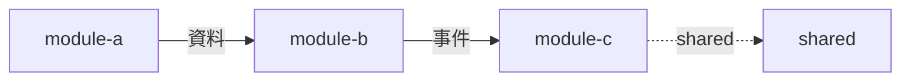

# 📝 [專案名稱] - 需求規格書 (PRD Lite)

**版本**: v{X.Y}  
**日期**: 2025-12-10  
**受眾**: 產品經理、利害關係人、開發者 (AI)  
**一句話願景**: {這個專案核心要解決什麼問題？}

> 📚 **相關文件**:  
> - [需求規格書指南](../guides/requirement-spec-guide.md) - 撰寫指引  
> - [專案技術規格書指南](../guides/project-spec-guide.md) - 技術實作規格  
> - [完整專案規格](../Full_Project_Spec.md) - Scanner 自動產生的技術規格

---

## 1. 🎯 核心目標與範圍

| 項目 | 內容 |
|------|------|
| **痛點** | {目前遇到了什麼困難？} |
| **解決方案** | {我們打算用什麼方式解決？} |
| **本次迭代範圍** | {這次要做的核心功能 (MVP)} |
| **不做什麼** | {明確排除，避免發散} |

---

## 2. 🧩 功能模組清單

> 💡 **模組 ID 命名規則**: 使用 kebab-case，對應 `Full_Project_Spec.md` 的模組名稱

### Story-{X.1}: {模組中文名稱} (`{module-id}`)

| 項目 | 內容 |
|------|------|
| **模組 ID** | `{module-id}` ← 對應 Full_Project_Spec 模組名 |
| **關聯 Schema** | `tbl_{table_name}` ← 對應資料庫表 |
| **優先級** | P0 🔴 / P1 🟡 / P2 🟢 |

**用戶故事**: 作為 {角色}，我想要 {做什麼}，以便於 {達成目的}。

**核心邏輯**:
1. {邏輯步驟 1}
2. {邏輯步驟 2}
3. {異常處理邏輯}

**必要資料欄位**:

| 欄位 | DB 欄位名 | 必填 | 業務規則 |
|------|-----------|------|----------|
| {中文名稱} | `{db_column}` | ✅ | {格式、長度、產生規則} |
| {中文名稱} | `{db_column}` | ❌ | {限制條件} |

---

### Story-{X.2}: {模組中文名稱} (`{module-id}`)

| 項目 | 內容 |
|------|------|
| **模組 ID** | `{module-id}` |
| **關聯 Schema** | `tbl_{table_name}` |
| **優先級** | P1 🟡 |

**用戶故事**: ...

**核心邏輯**: ...

**必要資料欄位**: ...

---

## 3. 📐 模組依賴圖

*對應 Full_Project_Spec.md 的「Module Dependencies」區塊*



**依賴說明**:

| 來源模組 | 目標模組 | 依賴類型 | 說明 |
|----------|----------|----------|------|
| `module-a` | `module-b` | 資料依賴 | {A 提供什麼給 B} |
| `module-b` | `module-c` | 事件依賴 | {B 提供什麼給 C} |

---

## 4. 🔄 關鍵流程圖

### Flow-1: {流程名稱}

**關聯 Story**: Story-{X.X}  
**對應函式**: `{functionName}` (參見 Full_Project_Spec P0 函式)

1. **{觸發點}** → 顯示 {A 資訊}
2. **點擊 {B 按鈕}** → 系統檢查 {C 條件}
3. **若成功** → {執行動作} → 跳轉至 {D 頁面}
4. **若失敗** → 顯示 {E 錯誤訊息}

### Flow-2: {流程名稱}

**關聯 Story**: Story-{X.X}

1. ...

---

## 5. 🖼️ 介面需求

**平台**: {Web / Mobile Web / Native App / CLI / Bot}

### 關鍵頁面

| 頁面 | 元件 ID | 包含元件 | 重點需求 |
|------|---------|----------|----------|
| {頁面 A} | `{PageName}` | {元件列表} | {易用性/資訊呈現} |
| {頁面 B} | `{PageName}` | {元件列表} | {操作效率/視覺反饋} |

### 設計風格
- {例如：Material Design / 極簡 / Dashboard 風格}
- {色彩偏好：深色模式 / 企業藍 / ...}

---

## 6. ✅ 驗收標準 (BDD 格式)

> 💡 驗收標準會對應到 Full_Project_Spec 中的 `GEMS-TEST` 欄位

### AC-1: {驗收名稱} → Story-{X.X}
**獨立可測性**: {說明此驗收如何獨立進行，不依賴其他 Story}
```gherkin
Given {前置條件}
When {操作動作}
Then {預期結果}
```
**測試類型**: ✓ Unit | ✓ Integration | - E2E

### AC-2: {驗收名稱} → Story-{X.X}
**獨立可測性**: {獨立驗證說明}
```gherkin
Given {前置條件}
When {操作動作}
Then {預期結果}
And {額外驗證}
```
**測試類型**: ✓ Unit | - Integration | - E2E

### AC-NFR: {非功能性驗收}
```gherkin
Given 系統正常運作
When 執行 {關鍵操作}
Then 回應時間應 < 5 秒
```

---

## 7. 🗄️ Schema 需求摘要

> 此區塊對應 Full_Project_Spec.md 的「資料庫 Schema」區塊

| 資料表 | 用途 | 關聯 Story |
|--------|------|------------|
| `tbl_{table_a}` | {用途說明} | Story-{X.X} |
| `tbl_{table_b}` | {用途說明} | Story-{X.X} |

### 列舉定義

| 欄位 | 可能值 | 說明 |
|------|--------|------|
| `{enum_column}` | {VALUE_A}, {VALUE_B} | {業務意義} |

---

## 8. ⚡ 效能與限制

| 項目 | 需求 | 說明 |
|------|------|------|
| **預期使用量** | {同時在線 X 人 / 日訂單 X 筆} | {尖峰時段} |
| **回應時間** | {關鍵操作 < X 秒} | {P99 標準} |
| **資料保留** | {保留 X 天/月/年} | {法規/業務需求} |
| **可用性** | {99.X%} | {維護時段} |

---

## 💡 給 AI 的實作提示

| 項目 | 內容 |
|------|------|
| **技術棧偏好** | {例：React + Node.js / Python + FastAPI / GAS} |
| **現有資源** | {已有的基礎設施、API、資料庫} |
| **風格要求** | {防呆機制強 / Log 詳細 / 極簡主義} |
| **限制條件** | {無法安裝 X / 必須使用 Y} |

---

## 📎 附件與參考

- {Figma 設計稿連結}
- {競品參考連結}
- {相關文件連結}

---

## 🔗 追溯矩陣 (Traceability)

| Story ID | 模組 ID | 資料表 | P0 函式 | 驗收標準 |
|----------|---------|--------|---------|----------|
| Story-{X.1} | `{module-id}` | `tbl_{table}` | `{funcName}` | AC-1, AC-2 |
| Story-{X.2} | `{module-id}` | `tbl_{table}` | `{funcName}` | AC-3 |

---

**文件版本**: v{X.Y} | **產出日期**: 2025-12-10 | **負責人**: {姓名/團隊}

