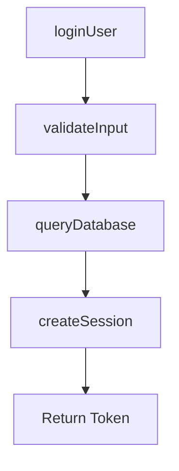

# Task-Pipe Evolution Blueprint (進化藍圖)

> 版本: v1.0 | 建立日期: 2026-01-30
> 借鏡來源: OpenClaw (openclaw-main)

---

## 📌 核心理念

**放寬格式，嚴守規格，智能執行，自動產出**

傳統 Task-Pipe 是一條「嚴格流水線」，每個 Gate 都可能卡住流程。
Evolution Blueprint 的目標是：讓 Task-Pipe 變成「智能流水線」，能自動判斷、自動修復、減少人工介入，同時保持規格書產出能力。

---

## 🏗️ 系統架構總覽

```
┌─────────────────────────────────────────────────────────────────────────────┐
│                         Task-Pipe v2.0 Evolution                             │
├─────────────────────────────────────────────────────────────────────────────┤
│                                                                              │
│  ┌───────────────────────────────────────────────────────────────────────┐  │
│  │                 【Layer 1: 遠端控制層 (Remote Controller)】            │  │
│  │                                                                       │  │
│  │   Telegram/Line Bot ──→ Command Parser ──→ Security Gate ──→ Executor│  │
│  │                                                                       │  │
│  │   功能:                                                               │  │
│  │   - 透過即時通訊發送指令 (/run, /status, /logs, /accept)             │  │
│  │   - IDE 操作 (開啟檔案、擷取畫面、OCR 判讀)                          │  │
│  │   - 低 Token 消耗 (規則判斷優先，LLM 判斷為輔)                       │  │
│  └───────────────────────────────────────────────────────────────────────┘  │
│                                   │                                          │
│                                   ▼                                          │
│  ┌───────────────────────────────────────────────────────────────────────┐  │
│  │                 【Layer 2: 智能調度層 (Smart Dispatcher)】             │  │
│  │                                                                       │  │
│  │   Ralph Loop ─────────────────────────────────────────────────────    │  │
│  │        │                                                              │  │
│  │        ▼                                                              │  │
│  │   ┌─────────────┐    ┌─────────────┐    ┌─────────────┐              │  │
│  │   │ Phase Runner│───→│Error Classifier│──→│Recovery Engine│           │  │
│  │   └─────────────┘    └─────────────┘    └─────────────┘              │  │
│  │                            │                  │                       │  │
│  │              ┌─────────────┼─────────────┐    │                       │  │
│  │              ▼             ▼             ▼    ▼                       │  │
│  │        [RECOVERABLE] [MAYBE]      [STRUCTURAL]                        │  │
│  │              │             │             │                            │  │
│  │              ▼             ▼             ▼                            │  │
│  │        Auto Fixer    Smart Gate     BLOCKER                           │  │
│  │        (自動修復)    (LLM 判斷)    (需人類介入)                        │  │
│  └───────────────────────────────────────────────────────────────────────┘  │
│                                   │                                          │
│                                   ▼                                          │
│  ┌───────────────────────────────────────────────────────────────────────┐  │
│  │                 【Layer 3: 寬鬆門控層 (Relaxed Gate)】                  │  │
│  │                                                                       │  │
│  │   Phase 4 Lite ──→ Smart Tag Extractor ──→ Spec Validator             │  │
│  │                                                                       │  │
│  │   原則:                                                               │  │
│  │   - 格式不限 (JSDoc, 單行註解, 自然語言皆可)                          │  │
│  │   - 內容必須 (Priority, Flow, Deps, Description)                      │  │
│  │   - 智能提取 (關鍵字 + 上下文分析)                                    │  │
│  └───────────────────────────────────────────────────────────────────────┘  │
│                                   │                                          │
│                                   ▼                                          │
│  ┌───────────────────────────────────────────────────────────────────────┐  │
│  │                 【Layer 4: 執行層 (Execution - 保持現狀)】              │  │
│  │                                                                       │  │
│  │   POC Phases ──→ PLAN Phases ──→ BUILD Phases ──→ SCAN               │  │
│  │                                                                       │  │
│  └───────────────────────────────────────────────────────────────────────┘  │
│                                   │                                          │
│                                   ▼                                          │
│  ┌───────────────────────────────────────────────────────────────────────┐  │
│  │                 【Layer 5: 規格書產出層 (Spec Generator)】              │  │
│  │                                                                       │  │
│  │   GEMS Scanner ──→ Spec Aggregator ──→ 規格書 (Markdown/HTML)         │  │
│  │                                                                       │  │
│  │   產出:                                                               │  │
│  │   - functions.json (結構化函式清單)                                   │  │
│  │   - SPEC_REPORT.md (人類可讀規格書)                                   │  │
│  │   - FLOW_DIAGRAM.md (流程圖)                                          │  │
│  └───────────────────────────────────────────────────────────────────────┘  │
│                                                                              │
└─────────────────────────────────────────────────────────────────────────────┘
```

---

## 📂 新增檔案結構

```
task-pipe/                          # 現有結構 (100% 保留)
├── runner.cjs                      # ✅ 不動
├── phases/                         # ✅ 不動
├── lib/                            
│   ├── shared/                     # ✅ 不動 (僅微調 loop.cjs)
│   └── scan/
│       ├── gems-validator.cjs      # ✅ 保留 (向後相容)
│       └── gems-patterns.cjs       # ✅ 保留
│
│   ════════════════════════════════════════════════════════════════
│   ↓↓↓ 以下全是新增 ↓↓↓
│   ════════════════════════════════════════════════════════════════
│
├── lib/
│   ├── error-classifier.cjs        # 🆕 錯誤分類器
│   ├── recovery-engine.cjs         # 🆕 復原引擎
│   ├── smart-gate.cjs              # 🆕 智能判斷層 (Minimal LLM)
│   └── scan/
│       └── gems-validator-lite.cjs # 🆕 寬鬆版驗證器
│
├── lib/auto-fixer/                 # 🆕 自動修復模組
│   ├── index.cjs                   # 入口
│   ├── gems-fixer.cjs              # GEMS 標籤修復
│   ├── route-fixer.cjs             # 路由註冊修復
│   ├── import-fixer.cjs            # Import 修復
│   └── test-fixer.cjs              # 測試檔案修復
│
├── lib/spec-generator/             # 🆕 規格書產出
│   ├── index.cjs                   # 入口
│   ├── aggregator.cjs              # 資料聚合
│   ├── markdown-renderer.cjs       # Markdown 產出
│   └── flow-diagram.cjs            # 流程圖產出
│
├── skills/                         # 🆕 SOP 文件 (借鏡 OpenClaw)
│   ├── gems-fixer/SKILL.md
│   ├── route-fixer/SKILL.md
│   └── test-fixer/SKILL.md
│
└── controller/                     # 🆕 遠端控制層
    ├── bot.cjs                     # Telegram/Line Bot 入口
    ├── command-parser.cjs          # 指令解析 (Zero Token)
    ├── executor.cjs                # IDE/Shell 執行
    ├── smart-gate.cjs              # LLM 判斷 (Minimal Token)
    ├── security.cjs                # 白名單 & 權限
    └── config.json                 # 設定檔
```

---

## 🔄 Layer 1: 遠端控制層

### 1.1 系統流程

```
用戶 (Telegram/Line)
        │
        │ 發送: "/run build"
        ▼
┌──────────────────────────────────────────────────────────────┐
│                    Command Parser                             │
│  ┌─────────────────┐  ┌─────────────────┐  ┌──────────────┐  │
│  │ /run <phase>    │  │ /status         │  │ /accept      │  │
│  │ 預定義指令       │  │ 讀取 JSON       │  │ 需要判斷      │  │
│  │ → 直接執行       │  │ → 直接回報      │  │ → Smart Gate │  │
│  └─────────────────┘  └─────────────────┘  └──────────────┘  │
└───────────────────────────────┬──────────────────────────────┘
                                │
         ┌──────────────────────┴──────────────────────┐
         │                                              │
         ▼                                              ▼
┌─────────────────────────┐              ┌─────────────────────────┐
│   Executor (Zero Token) │              │   Smart Gate (Low Token) │
│                          │              │                          │
│  - exec("node runner.js")│              │  - OCR 結果判讀           │
│  - 讀取 log files        │              │  - IDE 輸出判斷           │
│  - IDE CLI 操作          │              │  - 約 100-200 tokens/次   │
└─────────────────────────┘              └─────────────────────────┘
                │                                      │
                └──────────────────┬───────────────────┘
                                   ▼
                          回報 (Telegram/Line)
```

### 1.2 指令集設計

| 指令 | Token 消耗 | 說明 |
|------|-----------|------|
| `/run <phase>` | 0 | 執行 Task-Pipe 階段 |
| `/status` | 0 | 查看 story_status.json |
| `/logs` | 0 | 查看最新 log 檔案 |
| `/accept` | 0~200 | 確認 IDE 對話框 (可能需 OCR) |
| `/screenshot` | 0 | 擷取畫面 |
| `/ocr` | 100~200 | OCR + 智能判讀 |
| `/cancel` | 0 | 取消當前任務 |
| `/help` | 0 | 顯示指令說明 |

### 1.3 安全性設計

```javascript
// security.cjs
const ALLOWED_PROJECTS = [
  'c:\\Users\\user\\Desktop\\gems-flow-test\\my_workflow',
  'c:\\Users\\user\\Desktop\\gems-flow-test\\health-tracker-pro',
];

const ALLOWED_COMMANDS = [
  '/run', '/status', '/logs', '/accept', '/cancel', '/help', '/screenshot', '/ocr'
];

const ALLOWED_USERS = [
  'your_telegram_user_id',  // 白名單用戶
];
```

---

## 🔄 Layer 2: 智能調度層

### 2.1 錯誤分類系統

借鏡 OpenClaw 的 `classifyFailoverReason`，建立 Task-Pipe 專用的錯誤分類：

```javascript
// lib/error-classifier.cjs

const ERROR_PATTERNS = [
  // === RECOVERABLE (可自動修復) ===
  { pattern: /Missing GEMS-FUNC/i, type: 'GEMS_TAG_MISSING', recoverable: true },
  { pattern: /Route not registered/i, type: 'ROUTE_NOT_REGISTERED', recoverable: true },
  { pattern: /Module not exported/i, type: 'EXPORT_MISSING', recoverable: true },
  { pattern: /Import.*not found/i, type: 'IMPORT_MISSING', recoverable: true },
  { pattern: /Cannot find.*test.*file/i, type: 'TEST_FILE_MISSING', recoverable: true },
  
  // === MAYBE (需智能判斷) ===
  { pattern: /Test failed.*expected/i, type: 'TEST_ASSERTION_FAIL', recoverable: 'maybe' },
  { pattern: /Type.*not assignable/i, type: 'TYPE_MISMATCH', recoverable: 'maybe' },
  { pattern: /覆蓋率.*%/i, type: 'COVERAGE_LOW', recoverable: 'maybe' },
  
  // === STRUCTURAL (結構性問題，需人類介入) ===
  { pattern: /Cannot read.*undefined/i, type: 'RUNTIME_ERROR', recoverable: false },
  { pattern: /Maximum call stack/i, type: 'INFINITE_LOOP', recoverable: false },
  { pattern: /ENOENT/i, type: 'FILE_NOT_FOUND', recoverable: false },
  { pattern: /Syntax error/i, type: 'SYNTAX_ERROR', recoverable: false },
];

function classifyError(logContent) {
  for (const { pattern, type, recoverable } of ERROR_PATTERNS) {
    if (pattern.test(logContent)) {
      return { type, recoverable, match: logContent.match(pattern)?.[0] };
    }
  }
  return { type: 'UNKNOWN', recoverable: false };
}
```

### 2.2 復原引擎

```javascript
// lib/recovery-engine.cjs

const RECOVERY_MAP = {
  'GEMS_TAG_MISSING': require('./auto-fixer/gems-fixer.cjs'),
  'ROUTE_NOT_REGISTERED': require('./auto-fixer/route-fixer.cjs'),
  'IMPORT_MISSING': require('./auto-fixer/import-fixer.cjs'),
  'EXPORT_MISSING': require('./auto-fixer/import-fixer.cjs'),
  'TEST_FILE_MISSING': require('./auto-fixer/test-fixer.cjs'),
};

async function attemptRecovery(errorType, context) {
  const fixer = RECOVERY_MAP[errorType];
  if (!fixer) return { success: false, reason: 'No fixer available' };
  
  try {
    const result = await fixer.fix(context);
    return { success: result.fixed, changes: result.changes };
  } catch (err) {
    return { success: false, reason: err.message };
  }
}
```

### 2.3 整合到 Loop

```javascript
// loop.cjs 修改 (僅新增條件分支)

const result = await runPhase(phase, step);

if (result.status === 'BLOCKER') {
  // === 🆕 智能復原嘗試 ===
  if (process.env.ENABLE_SMART_RECOVERY === 'true') {
    const { type, recoverable } = classifyError(result.log);
    
    if (recoverable === true) {
      const recovery = await attemptRecovery(type, result.context);
      if (recovery.success) {
        console.log(`[Recovery] 自動修復成功: ${type}`);
        continue;  // 重試
      }
    }
    
    if (recoverable === 'maybe') {
      const judgment = await smartGate.analyze(result.log);
      if (judgment.canFix) {
        await smartGate.applyFix(judgment.suggestion);
        continue;  // 重試
      }
    }
  }
  // === 智能復原結束，回到原有邏輯 ===
  
  // 原有 BLOCKER 處理...
}
```

---

## 🔄 Layer 3: 寬鬆門控層 (Phase 4 Lite)

### 3.1 新版 Priority 與測試定義 (Mock 黃金法則)

**Mock 定義**: 「永遠優先使用真實依賴。只有在依賴項目**未實作**或屬於**預設擴充**時，才允許 Mock。」

| Priority | 定義 | 判斷標準 | 測試要求 | Mock 限制 |
|----------|------|----------|----------|-----------|
| **P0** | 端到端協議 | 涉及 API、前後端串接、DB 操作、第三方服務 | **E2E** + Integration + Unit | **嚴格禁止 Mock**<br>(僅允許未實作/擴充之依賴 Mock) |
| **P1** | 整合依賴 | 有明確 GEMS-DEPS 依賴 (模組/服務) | **Integration** + Unit | **真實優先**<br>(有實作必用真，無實作才 Mock) |
| **P2** | 獨立功能 | 純邏輯計算、無外部依賴之 UI 元件 | **Unit** | 允許 Mock 依賴 |

> **比重原則**: Unit Test 數量應最多，Integration 次之，E2E 最少但最關鍵。

### 3.2 格式寬鬆原則 (內容恆定)

**核心理念**: 標籤注入方式可能不同 (腳本、手寫、AI 生成)，導致格式 (星號、縮進) 變異，但**內容物** (Flow 步驟、依賴列表) 通常是穩定的。驗證器必須能穿透格式差異，抓取核心內容。

✅ 必須都能通過驗證的格式範例：

```javascript
// 範例 1: 標準 Plan 產出 (常見，帶星號)
/**
 * GEMS: BottomNav | P0 | ✓✓ | (props)→Element | Story-1.2 | 底部導覽列
 * GEMS-FLOW: GetModules→RenderTabs→BindEvents
 * GEMS-DEPS: [UserConfig, ModuleRegistry]
 * GEMS-DEPS-RISK: LOW
 */

// 範例 2: 手寫/簡化 (無星號，單行)
// GEMS: BottomNav P0 底部導覽列
// FLOW: GetModules -> RenderTabs -> BindEvents
// DEPS: UserConfig, ModuleRegistry
// RISK: HIGH (P0 建議風險)

// 範例 3: 混合/自然語言 (AI 可能產出)
/**
 * Function: BottomNav (P0)
 * Description: 底部導覽列元件
 *
 * Flow:
 * 1. GetModules
 * 2. RenderTabs
 * 3. BindEvents
 *
 * Dependencies: UserConfig, ModuleRegistry (Risk: Medium)
 */
```

### 3.3 智能標籤提取器

```javascript
// lib/scan/gems-validator-lite.cjs

const KEYWORDS = {
  priority: [/\b(P0|P1|P2|P3)\b/i],
  flow: [
    /(?:GEMS-FLOW|FLOW|流程|步驟)[:\s：]*(.+)/i,
    /(\w+)\s*(?:→|->|=>)\s*(\w+)/g,
    /(?:Step|步驟)\s*\d+[:\s：]*(.+)/gi,
  ],
  deps: [
    /(?:GEMS-DEPS|DEPS|依賴|DEPENDENCIES)[:\s：]*(.+)/i,
    /(?:uses?|calls?|imports?|需要|調用|依賴)\s+(\w+)/gi,
  ],
  depsRisk: [
    /(?:GEMS-DEPS-RISK|DEPS-RISK|風險等級|RISK)[:\s：]*(LOW|MEDIUM|HIGH|低|中|高)/i,
  ],
  test: [
    /(?:GEMS-TEST|TEST|測試)[:\s：]*(.+)/i,
    /(✓|Unit|Integration|E2E)/g,
  ],
};

/**
 * 智能提取標籤 - 嘗試多種格式
 */
function extractSmartTags(comment) {
  const result = {
    priority: null,
    description: null,
    flow: null,
    deps: null,
    depsRisk: null,
    test: null,
  };
  
  // 逐一嘗試提取
  for (const [field, patterns] of Object.entries(KEYWORDS)) {
    for (const pattern of patterns) {
      const match = comment.match(pattern);
      if (match) {
        result[field] = match[1] || match[0];
        break;
      }
    }
  }
  
  // 提取描述 (排除關鍵字後的文字)
  const descMatch = comment.match(/[|｜]\s*([^|｜\n]{5,})/);
  if (descMatch) {
    result.description = descMatch[1].trim();
  } else {
    // 嘗試抓第一行非關鍵字文字
    const lines = comment.split('\n');
    for (const line of lines) {
      const cleaned = line.replace(/^[\s/*#]+/, '').trim();
      if (cleaned.length > 10 && !cleaned.match(/^(GEMS|FLOW|DEPS|TEST|P[0-3])/i)) {
        result.description = cleaned;
        break;
      }
    }
  }
  
  return result;
}

/**
 * 驗證規格落實 (新版規則)
 */
function validateSpecCompliance(fn) {
  const issues = [];
  const priority = fn.priority;
  
  // 共通：必須有 Priority + Description
  if (!priority) {
    issues.push({ field: 'priority', severity: 'ERROR', msg: '缺少 Priority' });
  }
  if (!fn.description) {
    issues.push({ field: 'description', severity: 'ERROR', msg: '缺少描述文字' });
  }
  
  // P0 規則
  if (priority === 'P0') {
    if (!fn.flow) issues.push({ field: 'flow', severity: 'ERROR', msg: 'P0 必須有 Flow' });
    if (!fn.depsRisk) issues.push({ field: 'depsRisk', severity: 'ERROR', msg: 'P0 必須有 Deps-Risk' });
  }
  
  // P1 規則
  if (priority === 'P1') {
    if (!fn.flow) issues.push({ field: 'flow', severity: 'ERROR', msg: 'P1 必須有 Flow' });
    if (!fn.deps) issues.push({ field: 'deps', severity: 'ERROR', msg: 'P1 必須有 Deps' });
  }
  
  // P2 規則
  if (priority === 'P2') {
    if (!fn.flow) issues.push({ field: 'flow', severity: 'INFO', msg: 'P2 建議有 Flow (規格書用)' });
  }
  
  return issues;
}
```

---

## 🔄 Layer 5: 規格書產出層

### 5.1 產出物

| 檔案 | 格式 | 用途 |
|------|------|------|
| `functions.json` | JSON | 結構化函式清單 (機器可讀) |
| `SPEC_REPORT.md` | Markdown | 人類可讀規格書 |
| `FLOW_DIAGRAM.md` | Mermaid | 流程圖 |

### 5.2 規格書範例

```markdown
# 專案規格書

## 函式清單

### P0 函式 (E2E 功能)

#### `loginUser`
- **Priority**: P0
- **描述**: 使用者登入驗證
- **流程**: 驗證輸入 → 查詢資料庫 → 建立 Session
- **風險等級**: HIGH
- **測試**: E2E ✓ | Integration ✓ | Unit ✓
- **位置**: `src/auth/login.ts:42`

### P1 函式 (依賴功能)

#### `fetchUserProfile`
- **Priority**: P1
- **描述**: 取得使用者資料
- **流程**: 驗證 Token → 查詢 DB → 格式化回傳
- **依賴**: `AuthService`, `Database`, `Cache`
- **測試**: Integration ✓ | Unit ✓
- **位置**: `src/user/profile.ts:15`

## 流程圖


```

---

## 📋 實施路線圖

### Phase A: 錯誤分類系統 (Week 1-2)
優先級: ⭐⭐⭐⭐⭐

| 任務 | 說明 | 風險 |
|------|------|------|
| A1 | 建立 `lib/error-classifier.cjs` | ⚪ 零 |
| A2 | 收集過去 BLOCKER logs，整理 pattern | ⚪ 零 |
| A3 | 微調 `loop.cjs`，加入分類判斷 | 🟡 低 |

### Phase B: 自動修復引擎 (Week 3-4)
優先級: ⭐⭐⭐⭐

| 任務 | 說明 | 風險 |
|------|------|------|
| B1 | 建立 `lib/auto-fixer/` 目錄結構 | ⚪ 零 |
| B2 | 實作 `gems-fixer.cjs` | 🟡 低 |
| B3 | 實作 `route-fixer.cjs` | 🟡 低 |
| B4 | 建立 `skills/` SOP 文件 | ⚪ 零 |

### Phase C: Phase 4 放寬 (Week 3-4, 可並行)
優先級: ⭐⭐⭐⭐

| 任務 | 說明 | 風險 |
|------|------|------|
| C1 | 建立 `gems-validator-lite.cjs` | ⚪ 零 |
| C2 | 實作智能標籤提取器 | 🟡 低 |
| C3 | 修改 Phase 4 使用 Lite 版本 | 🟡 低 |
| C4 | 測試向後相容性 | 🟡 低 |

### Phase D: 遠端控制層 (Week 5-6)
優先級: ⭐⭐⭐

| 任務 | 說明 | 風險 |
|------|------|------|
| D1 | 建立 `controller/bot.cjs` | ⚪ 零 |
| D2 | 實作 `command-parser.cjs` | ⚪ 零 |
| D3 | 實作 `executor.cjs` | ⚪ 零 |
| D4 | 實作 `smart-gate.cjs` | 🟡 低 |
| D5 | 整合 Telegram Bot API | 🟡 低 |

### Phase E: 規格書產出 (Week 6-7)
優先級: ⭐⭐⭐

| 任務 | 說明 | 風險 |
|------|------|------|
| E1 | 建立 `lib/spec-generator/` | ⚪ 零 |
| E2 | 實作 Markdown 產出 | ⚪ 零 |
| E3 | 實作流程圖產出 | ⚪ 零 |
| E4 | 整合到 SCAN 階段 | 🟡 低 |

---

## 📊 預期效果

| 指標 | 現況 | 目標 |
|------|------|------|
| 人工介入頻率 | 每 3-5 個 Story | 每 10-15 個 Story |
| 路由整合成功率 | ~60% | ~90% |
| GEMS Tag 完整率 | ~80% | ~95% |
| Token 消耗 (自動修復) | 0 (直接 BLOCKER) | ~200/次 (僅 maybe 類型) |
| 平均 Story 完成時間 | 人工介入時大幅延遲 | 穩定 5-10 分鐘/Story |
| 規格書產出 | 手動整理 | 自動產出 |

---

## 🔗 參考資料與技術細節 (Borrowed from OpenClaw)

- OpenClaw 原始碼: `github_project/openclaw-main/`

### 1. Context Compaction (上下文壓縮技術)
> 來源: `src/agents/compaction.ts`
用於 Layer 1 & 2 的 Log 處理，避免 Token 爆炸。

- **Token Share Splitting**: 將過長的 Log 依據 Token 比例 (預設 40%) 進行切割。
- **Recursive Summarization**: 採用「分塊 -> 摘要 -> 合併」的遞迴策略。
- **Oversized Message Handling**: 若單一訊息超過 50% Context Window，則自動進行截斷或摘要，而非直接報錯。

### 2. PTY Execution (偽終端機執行)
> 來源: `src/agents/bash-tools.exec.ts`
用於 Layer 1 Executor，確保能執行互動式 CLI (如 npm login, codex)。

- **node-pty**: 必須使用 `node-pty` 而非單純 `child_process.spawn`。
- **DSR Stripping**: 自動過濾終端機的游標位置回報 (Device Status Report)，避免 Log 污染。
- **Background Yielding**: 支援背景執行模式，允許長時間任務 (如 npm install) 不卡住 Controller。

### 3. Smart Error Classification (智能錯誤分類)
> 來源: `src/agents/pi-embedded-helpers.ts`
用於 Layer 2 Error Classifier。

- **Granular Regex**: 使用精細的 Regex 庫識別具體錯誤 (Rate Limit, Auth, Context Overflow)。
- **Failover Logic**: 根據錯誤類型決定策略 (Retry, Rotate Key, Fallback Model)。

### 4. Spec-driven Installation (規格驅動安裝)
> 來源: `src/agents/skills-install.ts`
用於 Layer 2 Auto-Fixer。

- **Dependency Auto-Resolution**: 當發現 `import` 錯誤時，參考 `package.json` 或 `SKILL.md` 自動嘗試 `npm install` 或 `brew install`。

---

*藍圖建立時間: 2026-01-30 23:35 (Updated with Deep Dive findings)*
