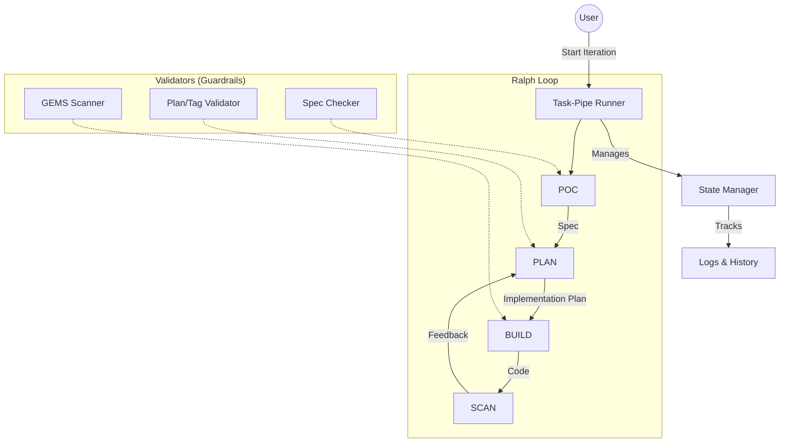

# Task-Pipe System Architecture & Logic Overview

> This document outlines the core philosophy, architecture, and workflow of the Task-Pipe system (also known as "Ralph Loop"). It serves as a discussion reference for understanding how the automated development pipeline functions.

## 1. Core Philosophy (核心理念)

The system is built on the principle of **"Constraint-Driven Autonomous Development"** (約束驅動的自主開發).

Instead of letting AI freely generate code (which often leads to hallucinations, inconsistencies, and maintenance nightmares), this system enforces a strict, staged pipeline where **thinking (Planning)** is separated from **doing (Building)**.

*   **Think First**: Define *what* to build down to the function level before writing a single line of code.
*   **Verify Often**: Every stage has a "Gate" (Validator) that must be passed before moving to the next.
*   **Fail Fast**: If a step fails, the system halts and provides specific instructions (Tactical Fixes) rather than cascading errors.

---

## 2. The Four Pillars (四大支柱)

The workflow is divided into four distinct phases, each with a specific responsibility:

### 2.1 POC (Proof of Concept) - "The Sketch"
*   **Goal**: Visualize the end result and define the "Contract".
*   **Input**: User idea / Requirement.
*   **Key Action**: Generate a standalone HTML file (`xxxPOC.html`) to verify UI/UX and data structure.
*   **Output**: `requirement_spec.md` (The "Truth").

### 2.2 PLAN (Planning) - "The Blueprint"
*   **Goal**: Break down the Spec into actionable, verified tasks.
*   **Input**: `requirement_spec.md`.
*   **Key Action**:
    *   **Step 1**: Confirm requirements.
    *   **Step 2**: Generate `implementation_plan.md` (Story-based).
    *   **Step 2.6**: **Tag Design**. This is critical. We inject `@GEMS` tags (Function signatures, dependencies, flow) into the plan. This turns the plan into a "Fill-in-the-blanks" exam paper.
*   **Output**: Validated `implementation_plan_Story-X.Y.md`.

### 2.3 BUILD (Construction) - "The Assembly"
*   **Goal**: Implement the code strictly according to the Plan.
*   **Input**: `implementation_plan_Story-X.Y.md`.
*   **Key Action**:
    *   **Phase 1 (Scaffold)**: Ensure environment and file structure exist.
    *   **Phase 4 (Scan)**: **The Enforcer**. Scans the source code to ensure every function matches the GEMS tags defined in the Plan. If you didn't implement it exactly as planned, you fail.
    *   **Phase 2/3 (Impl)**: Write the actual logic.
    *   **Phase 5 (Test)**: Verify with unit/integration tests.
*   **Output**: Working, tested code.

### 2.4 SCAN (Verification) - "The Audit"
*   **Goal**: Final quality assurance.
*   **Key Action**: Check coverage, linting, and overall project health.

---

## 3. System Architecture (系統架構)



### Key Components

*   **Runner (`runner.cjs`)**: The orchestrator. It executes phases, handles errors, and decides the next step.
*   **Phases (`phases/`)**: Scripts defining the logic for each step (e.g., `step-1.cjs`, `phase-4.cjs`).
*   **Tools (`tools/`)**: Specialized utilities (e.g., `migrate-poc-ui`, `env-checker`) that perform specific tasks.
*   **Logs (`logs/`)**: The communication medium. Scripts output structured logs (`@PASS`, `@BLOCKER`, `@TACTICAL_FIX`) which the Runner (and the AI) reads to understand what happened.

---

## 4. The "Secret Sauce": GEMS Tags

The unique feature of this system is the **GEMS Tag System**. It bridges the gap between Plan and Code.

*   In **PLAN**, we define:
    ```javascript
    // GEMS: createUser | P0 | (name) -> User
    ```
*   In **BUILD**, we must write:
    ```javascript
    /**
     * GEMS: createUser | P0 | (name) -> User
     */
    function createUser(name) { ... }
    ```
*   **Phase 4 Scanner** acts as the compiler. If the signature in code doesn't match the tag in Plan, the build fails. This ensures **Design-Code Consistency**.

---

## 5. Why is it so complex? (為什麼這麼複雜？)

1.  **Context Management**: AI has a limited context window. By breaking tasks into tiny, atomic steps (Story-1.0, 1.1...), we ensure the AI never gets overwhelmed.
2.  **Self-Correction**: The Loop detects errors (via exit codes and logs) and attempts to fix them (Tactical Fix) before asking for human help. This requires elaborate error handling logic.
3.  **Determinism**: We trade speed for reliability. A 10-step rigorous process is slower than a 1-step "Do it all", but it produces working software, whereas "Do it all" usually produces a prototype that falls apart.

---

**Summary for Discussion:**
The system is an **Automated SDLC (Software Development Life Cycle) Enforcer**. It forces the AI to behave like a disciplined senior engineer—planning before coding, writing tests, and adhering to architectural standards—rather than just "generating code".
