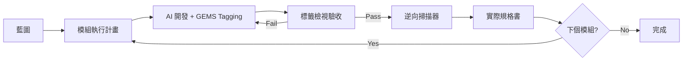

# GEMS 雙向閉環模型 (Dual-Loop Development)

**版本**: v1.0  
**日期**: 2025-12-06  
**核心哲學**: 藍圖是承諾，程式碼是真相，規格書是快照

> 📚 **相關文件**:  
> - [GEMS 標籤完整指南](./gems-tagging-complete-guide.md)  
> - [模組化衝刺指南](./modular-sprint-guide.md)  
> - [模組化架構準則](./modular-architecture-guide.md)

---

## 1. 模型概述

雙向閉環解決傳統開發中「規格書永遠跟程式碼脫節」的痛點。

```
藍圖 → 開發 → 掃描 → 規格 → 驗證 → (下一個模組)
```

---

## 2. 三個階段

### Phase 1: 藍圖設計 (Blueprint)

**方向**: 順向 (Forward) | 腦袋 → 文件

在寫任何 Code 之前，架構師對系統的宏觀承諾。

**產出物**: `MASTER_BLUEPRINT.md`

**包含內容**:
1. **需求清單 (Backlog)**: 列出所有 `Story-X.X`
2. **技術棧規格**: 前端 Vibe, 後端框架, 資料庫
3. **容量規劃**: 資料量估算, 效能指標

---

### Phase 2: 綠地開發循環 (Greenfield Loop)

**方向**: 混合 (Hybrid) | 藍圖 → Code → 逆向規格



**關鍵動作**: 逆向掃描 🌟

```bash
npm run gems:scan
```

- 腳本爬過所有檔案，抓取 `Story-X.X` 對應的函數和標籤
- 自動生成 `Full_Project_Spec.md`
- **這份文件永遠不會過期**，因為它是由 Code 生成的

---

### Phase 3: 棕地維護循環 (Brownfield Loop)

**方向**: 逆向 (Reverse) | Code → 掃描 → 需求變更 → Code

系統上線後要回來改功能時：

1. **掃描現況**: 先跑 `gems:scan` 產生 `CURRENT_STATE.md`
2. **迭代需求**: 基於現況撰寫 `CHANGE_REQUEST.md`
3. **更新代碼**: AI 修改 Code + 更新 Tag
4. **再次掃描**: 更新規格書

---

## 3. 標籤驗收流程

### 不看 Code，只看 Tag

驗收時檢查：

| 檢查項目 | 通過標準 |
|----------|----------|
| `GEMS-FLOW` | 邏輯通順，3-5 步驟 |
| `GEMS-DEPS` | 無 `[cross-module]` 依賴 |
| `GEMS-TEST` | P0/P1 有 Unit + Integration |
| `GEMS-UI` | 有明確 Zones 定義 |

如果 `GEMS-FLOW` 讓人看不懂，代表邏輯有問題 → 直接退件，不需要跑程式就能發現設計缺陷。

---

## 4. 掃描器整合

### 4.1 新標籤識別

掃描器應識別以下前端標籤：

```javascript
// 核心標籤 (原有)
const CORE_TAGS = ['GEMS:', 'GEMS-FLOW:', 'GEMS-DEPS:', 'GEMS-TEST:'];

// UI 標籤 (新增)
const UI_TAGS = ['GEMS-UI:', 'GEMS-LAYOUT:', 'GEMS-ZONE:', 'GEMS-ATOM:'];

// POC 標籤 (新增)
const POC_TAGS = ['@GEMS-STORY:', '@GEMS-CONTRACT:', '@GEMS-UI:', '@GEMS-MOCK:'];
```

### 4.2 輸出格式

```json
{
  "story": "Story-15.1",
  "file": "examples/MealCardPOC.tsx",
  "contracts": ["MealItem"],
  "ui": {
    "container": "CardContainer",
    "layout": "Flex-Col",
    "zones": ["Header", "Body", "Action"]
  }
}
```

---

## 5. 模型優勢

1. **解決文件債**
   - 規格書是 Build 產物，像編譯的 `.js` 檔
   - 每次 Scan 都是最新的

2. **AI 最佳工作流**
   - AI 不擅長「記住以前寫過什麼」
   - **先掃描 (Scan First)** = 每次餵最新 Context

3. **驗收具象化**
   - 「標籤檢視」= 最具體的驗收標準
   - 不需跑程式就能發現設計缺陷

---

**文件版本**: v1.0 | **產出日期**: 2025-12-06
